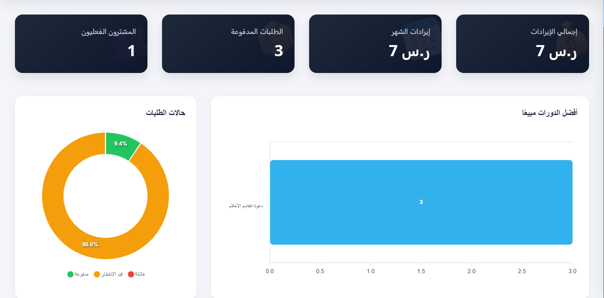
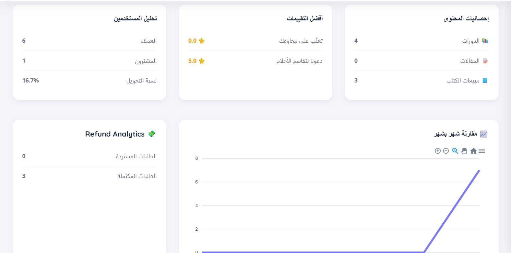
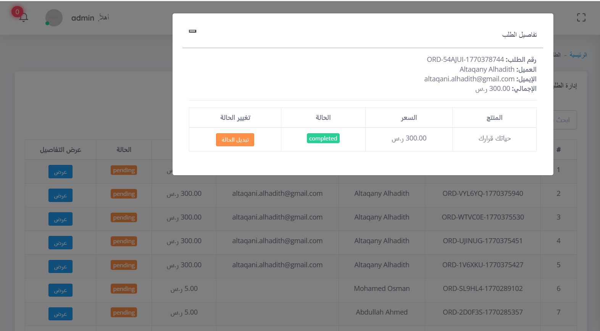
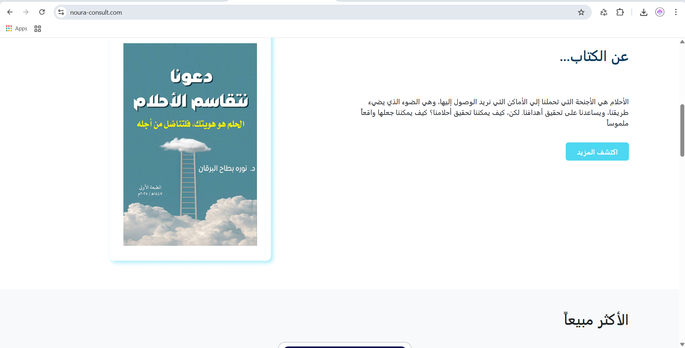
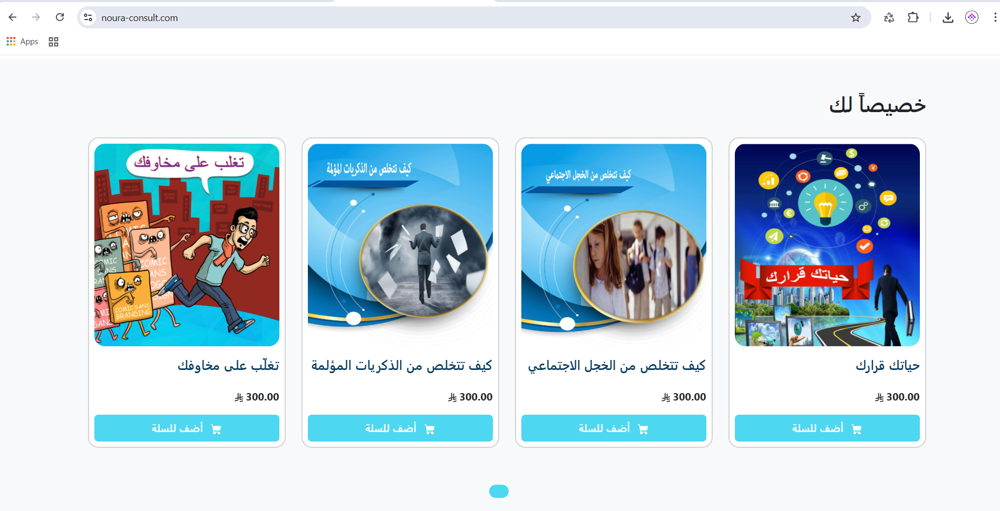
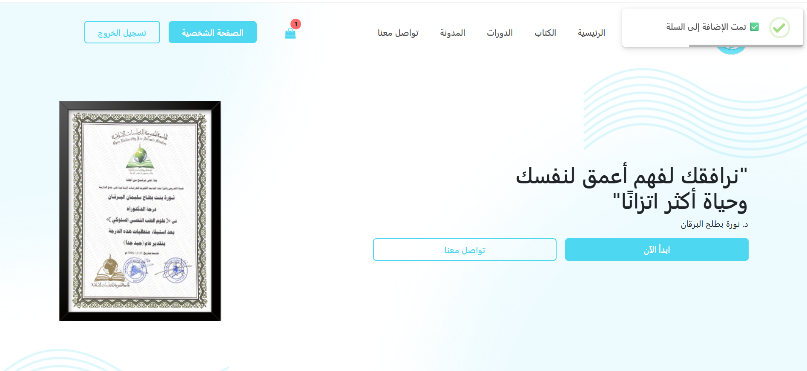
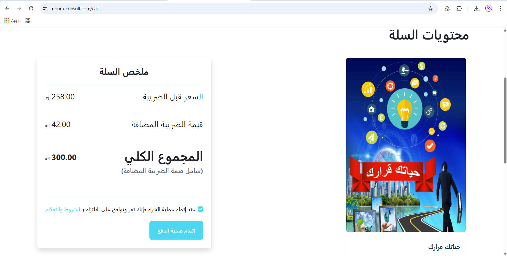
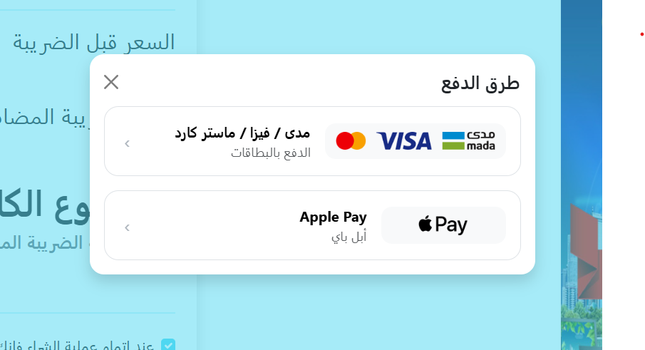
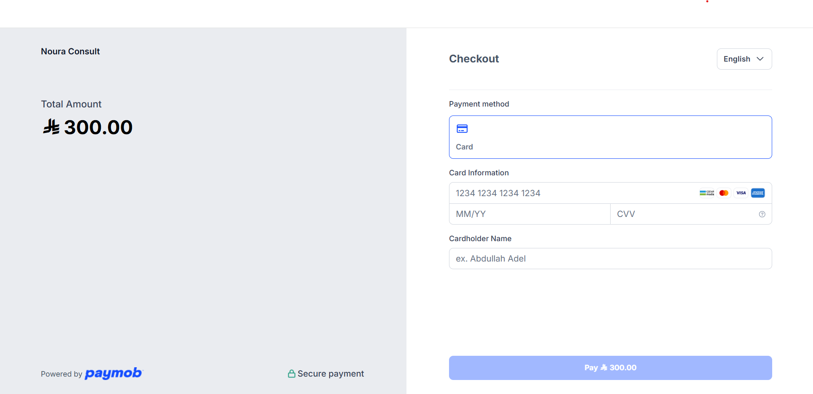

  

<h1 align="center">Courses & Books Platform</h1>

  <b>Laravel 11</b> • Online Courses & Books E-Commerce • OTP Auth • Paymob Payments • Admin Analytics Dashboard

  
  
  
  
  
  

  <a href="#-overview">Overview</a> •
  <a href="#-key-features">Key Features</a> •
  <a href="#-screenshots">Screenshots</a> •
  <a href="#-architecture">Architecture</a> •
  <a href="#-tech-stack">Tech Stack</a> •
  <a href="#-setup">Setup</a>

---

## 📌 Overview

**Courses & Books Platform** is a full-stack web application built with **Laravel 11** that enables users to browse and purchase digital products (online courses & books), manage orders, and complete secure payments through **Paymob**.

It includes a modern public website, a dynamic **AJAX cart experience**, and a powerful **Admin Dashboard** with analytics and management capabilities.

---

## ✨ Key Features

<table>
  <tr>
    <td width="50%" valign="top">

### 👤 Authentication & Security
- Email verification via **OTP Code**
- Password reset via **OTP email**
- Secure login & user sessions

### 🛒 Cart & Checkout
- Add to cart using **AJAX (Fetch API)**
- Live cart count updates
- VAT calculation & order summary

    </td>
    <td width="50%" valign="top">

### 💳 Online Payments (Paymob)
- Visa / MasterCard / Mada
- Apple Pay support
- Secure hosted checkout flow

### 🧑‍💼 Admin Panel & Management
- Analytics dashboard (revenue / orders / status)
- Orders management (search, details, status updates)
- Content management (Courses, Books, Blog)
- Roles & permissions for admin users

    </td>
  </tr>
</table>

---

## 🖼️ Screenshots

> All images are stored in: `README_ASSETS/`

### 📊 Admin Dashboard (Analytics)

  

  

---

### 📦 Orders Management

<table>
  <tr>
    <td width="50%">
      
    </td>
    <td width="50%">
      
    </td>
  </tr>
</table>

---

### 🌐 Public Website

<table>
  <tr>
    <td width="50%">
      
    </td>
    <td width="50%">
      
    </td>
  </tr>
</table>

---

### 🛒 Add to Cart (AJAX) & Cart

<table>
  <tr>
    <td width="50%">
      
    </td>
    <td width="50%">
      
    </td>
  </tr>
</table>

---

### 💳 Payments (Paymob)

<table>
  <tr>
    <td width="50%">
      
    </td>
    <td width="50%">
      
    </td>
  </tr>
</table>

---

## 🧱 Architecture

This project follows clean, scalable principles:

- **Service Layer Pattern**
- **Repository Pattern**
- Separation of concerns
- Maintainable structure and reusable business logic

**Why this matters:**
- Easier testing & feature expansion
- Business logic is isolated from controllers
- Database queries are abstracted in repositories

---

## 🧰 Tech Stack

| Layer | Technology |
|------|------------|
| Backend | Laravel 11, PHP 8+ |
| Frontend | Blade, Bootstrap, JavaScript |
| AJAX | Fetch API |
| Database | MySQL |
| Payments | Paymob (Cards + Apple Pay) |
| Auth | OTP via Email (Verification + Reset) |
| Analytics | Charts + Dashboard Widgets |

---
## ⭐ Project Highlights

- Built with **Laravel 11** using clean architecture principles
- Fully AJAX-powered cart experience
- OTP-based authentication & password recovery
- Secure payment integration with Paymob
- Analytics-rich admin dashboard
- Scalable service & repository pattern implementation

---

## 👨‍💻 Developed By

**Khaled Ahmed (Altqani)**  
Full-Stack Laravel Developer  

- Expertise in Laravel, REST APIs & Payment Integrations  
- Focused on clean architecture & scalable systems  

📧 Email: akhaled795@gmail.com  
🔗 GitHub: https://github.com/Khaled7952

